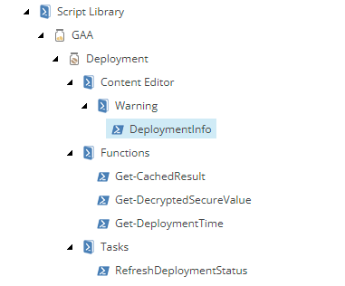
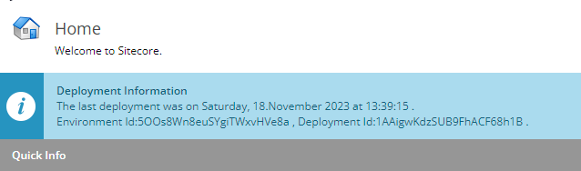

# xmcloud-deployment-info-bar

A Powershell module which reads the latest deployment information from xmCloud App API and shows it in the Sitecore.

Full Article is available here: https://www.ashournia.com/item-deployment-in-sitecore-xmcloud/

Keep in mind when you are using the Encrypt function, use the single quote to pass in the parameters.

